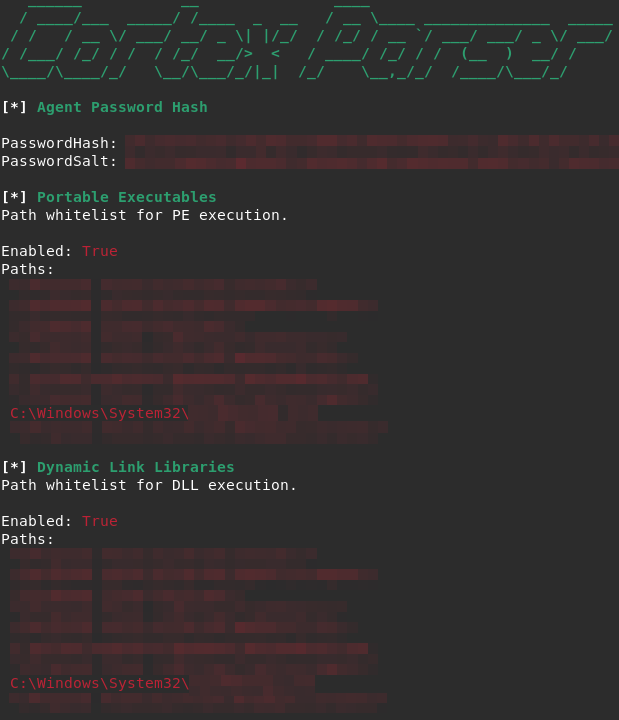

## Legacy project: current Cortex version is 8.9

This is a post-exploitation tool that gathers Cortex XDR configuration aiming to find potential exclusions for further execution.



It supports the current Cortex version (8.3) and it is based on [Cortex-XDR-Config-Extractor](https://github.com/Laokoon-SecurITy/Cortex-XDR-Config-Extractor) from Laokoon SecurITy.

#### Usage:
Current Cortex versions only allow acess to the Database Lock files needed to extract its configuration to users with administrator privileges. These files are located on:
`C:\ProgramData\Cyvera\LocalSystem\Persistence\agent_settings.db`

Every file on this folder is required to correctly read from the LevelDB. Those are as follows:
*.ldb  CURRENT  LOCK  LOG  LOG.OLD  MANIFEST-*

The script expects the route of the folder containing the files as an argument:
```shell
./CortexParser.py [LDB_Files]
```

#### Database Contents:
The LevelDB files contain 2 interesting key-value pairs:
- policyRaw = JSON that contains most whitelist exceptions:
  - FileTypeBatchScript, FileTypeDll, FileTypeDotnetExecutable & FileTypeExecutable
  - FileTypeJavaScript, FileTypeMshta, FileTypeOfficeDocs, FileTypePdf, FileTypePowerShell & FileTypeVBScript
  - PasswordHash & PasswordSalt
  - TrustedPublishers & UserPublishers
- settings = Python memory dump that contains some more JSON configurations:
  - scanEndpoints
  - webshellDroppers
  - examineOfficeFiles & examineScriptFiles
  - legitimateProcesses
  - dynamicSecurityEngine
  - whitelistSigners (examinePortableExecutables)
